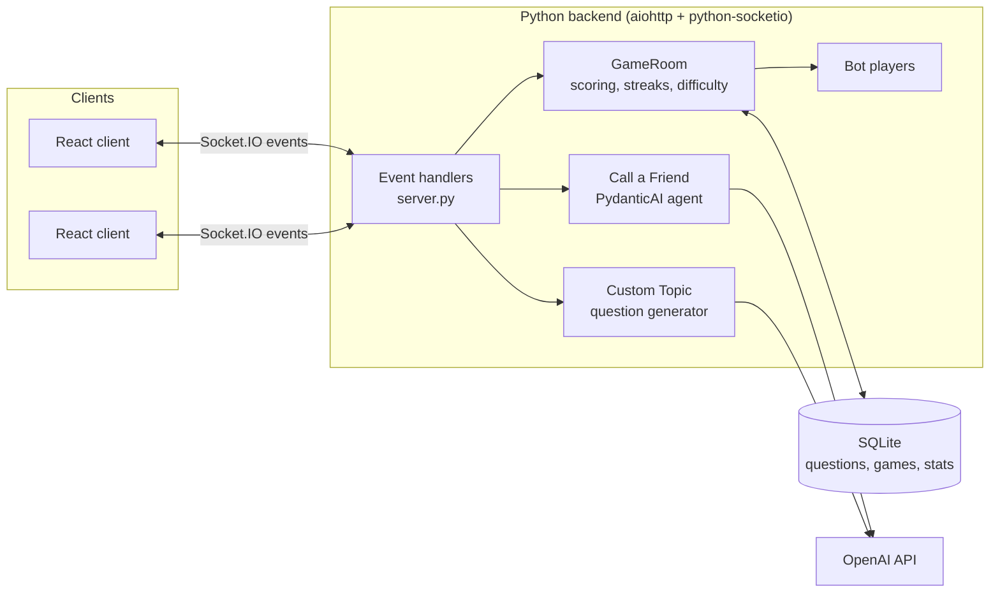
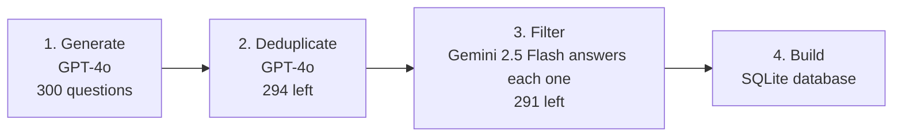

<div align="center">

# ⚡ TriviaBlitz

**A real-time multiplayer trivia game with bots, power-ups, adaptive difficulty, and an LLM-built question bank.**


<!-- Add a screenshot or GIF of a game in progress here, e.g.:
 -->

</div>

## About

Players join a shared lobby, then race through 10 timed questions together. They see live when others answer, use power-ups at the right moment, and chat during the game. If you play alone, bots join so there's always someone to beat.

## Features

- **Real-time multiplayer:** a lobby with a 30-second matchmaking countdown, synchronized questions, live "player answered" indicators, and a leaderboard reveal after each question.
- **Bots when you play solo:** 1–3 bots with human-like answer delays (never under 2 seconds). Their accuracy falls from 95% on easy questions to 18% on the hardest.
- **Adaptive difficulty:** questions are rated 1–10. The next question gets harder after a correct answer and easier after a wrong one.
- **Speed-based scoring with streaks:** an instant answer earns up to 1,000 points, falling to 100 at the 20-second limit. Consecutive correct answers add a multiplier of up to 2×.
- **Power-ups:**
  - **50/50** removes two wrong answers.
  - **Call a Friend** asks an LLM "friend" for a hint, delivered in a dramatic character (PydanticAI + GPT-4o-mini).
  - **Double Score** doubles the points for one question.
- **Custom Topic mode:** type any topic, and GPT-4o-mini generates 10 fresh questions about it.
- **Chat and emoji reactions** during the game.
- **Persistent stats:** SQLite stores every game, per-player statistics, and an all-time leaderboard.

## Architecture



All game state lives on the server, and clients only send intents like `submit_answer` or `use_powerup`. The server decides scores and timing, so a client can't cheat by manipulating its own state.

### How the question bank was built



A stronger model writes the questions. A smaller model then tries to answer each one with the options shuffled, and any question it gets wrong is dropped as too obscure or ambiguous. The whole pipeline runs from one script (`scripts/run_pipeline.py`).

## Tech stack

| Layer | Technologies |
| --- | --- |
| Backend | Python, python-socketio, aiohttp, aiosqlite |
| Frontend | React 19, Vite, socket.io-client |
| AI | OpenAI (GPT-4o, GPT-4o-mini), PydanticAI, Google Gemini 2.5 Flash |
| Data | SQLite, pandas |

## Running locally

**Requirements:** Python 3.10+, Node.js 20+, an OpenAI API key (and a Google API key only if you rerun the question pipeline).

```bash
git clone https://github.com/ofriv/TriviaBlitz.git
cd TriviaBlitz

# Backend
python -m venv .venv
.venv\Scripts\activate                  # macOS/Linux: source .venv/bin/activate
pip install -r backend/requirements.txt -r scripts/requirements.txt
cp .env.example .env                    # then add your API keys
python scripts/run_pipeline.py --only 4 # build the SQLite DB from the included questions
python backend/server.py                # http://localhost:8000

# Frontend (in a second terminal)
cd frontend
npm install
npm run dev
```

On Windows, `start_server.ps1` and `start_frontend.ps1` start both parts. To play with friends on other devices, expose the backend with a tunnel such as ngrok or Pinggy, and set `BACKEND_URL` in `frontend/src/hooks/useSocket.js` to the public URL.

## Project structure

```
├── backend/
│   ├── server.py        # Socket.IO event handlers
│   ├── game.py          # GameRoom: rounds, scoring, streaks, adaptive difficulty
│   ├── bot.py           # Bot players
│   ├── call_friend.py   # Call a Friend (PydanticAI agent)
│   ├── ai_questions.py  # Custom Topic question generation
│   └── database.py      # SQLite access
├── frontend/src/
│   ├── components/      # Landing, Lobby, Question, Reveal, GameOver, Chat
│   └── hooks/useSocket.js
├── scripts/             # 4-step question pipeline
└── data/                # Question CSVs from each pipeline step
```

## What I'd improve next

- **Multiple concurrent games:** today, the server runs a single lobby and one game at a time.
- **Cloud deployment,** so friends can join without a tunnel
- **Automated tests** for the scoring and difficulty logic

## License

[MIT](LICENSE)
